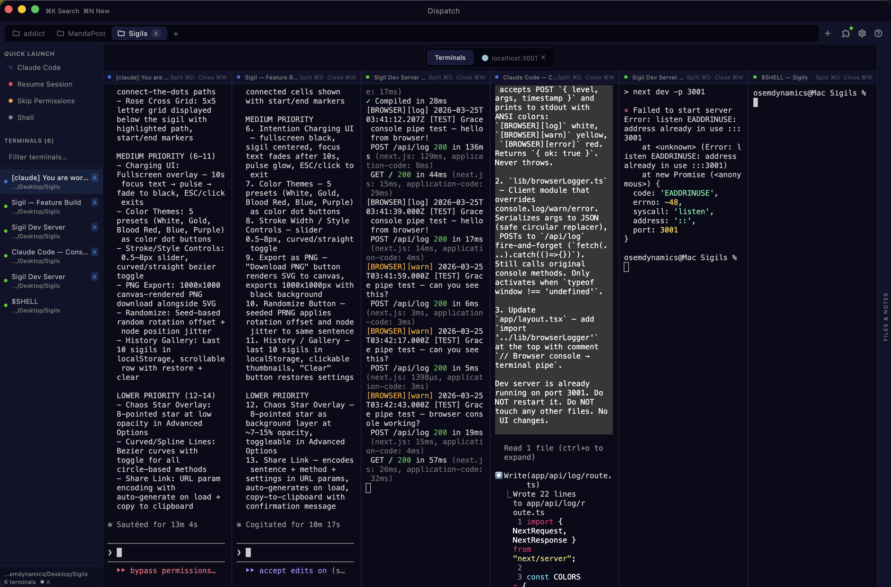
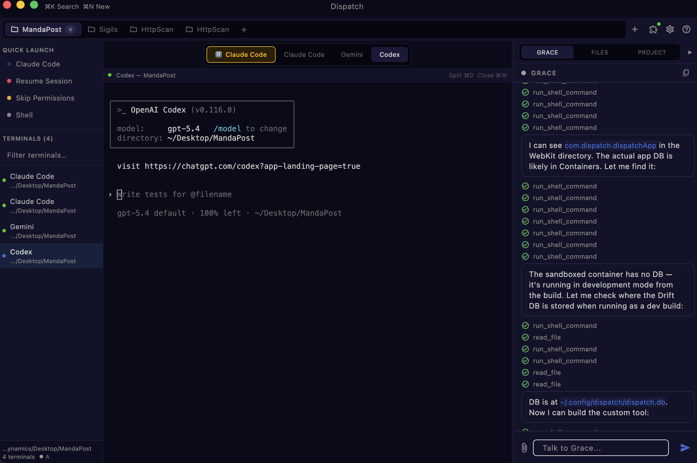
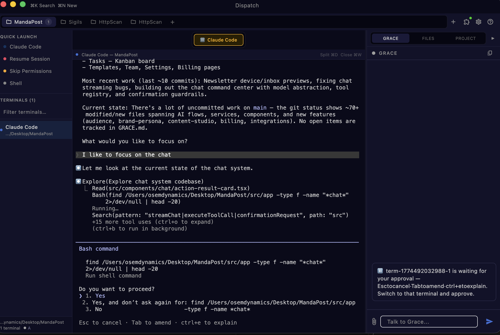
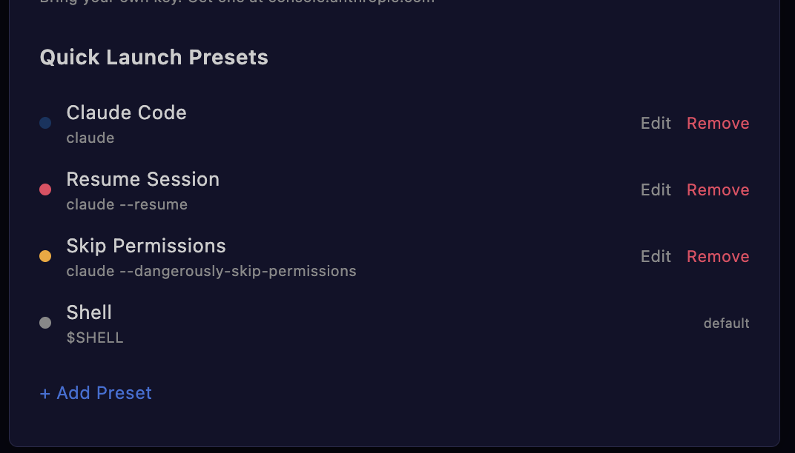
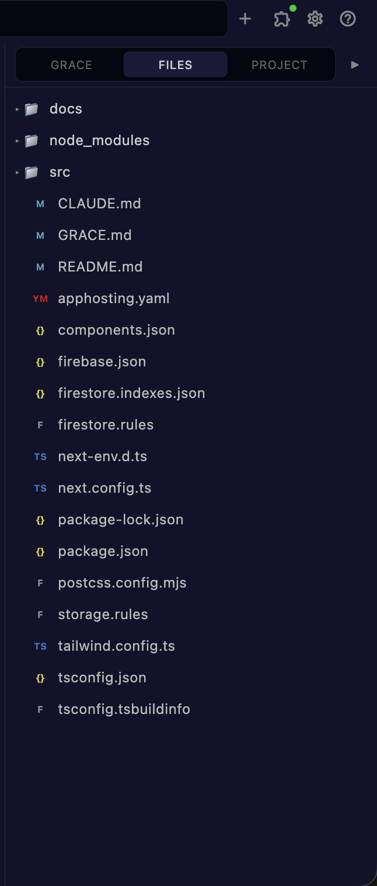
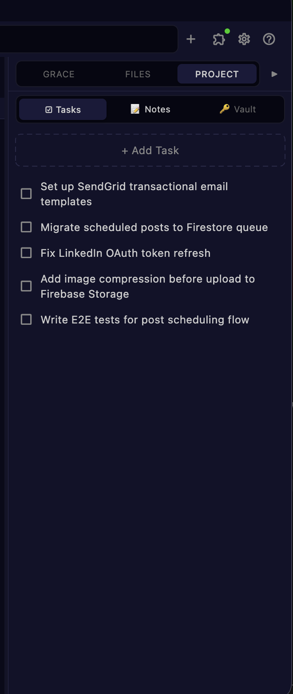
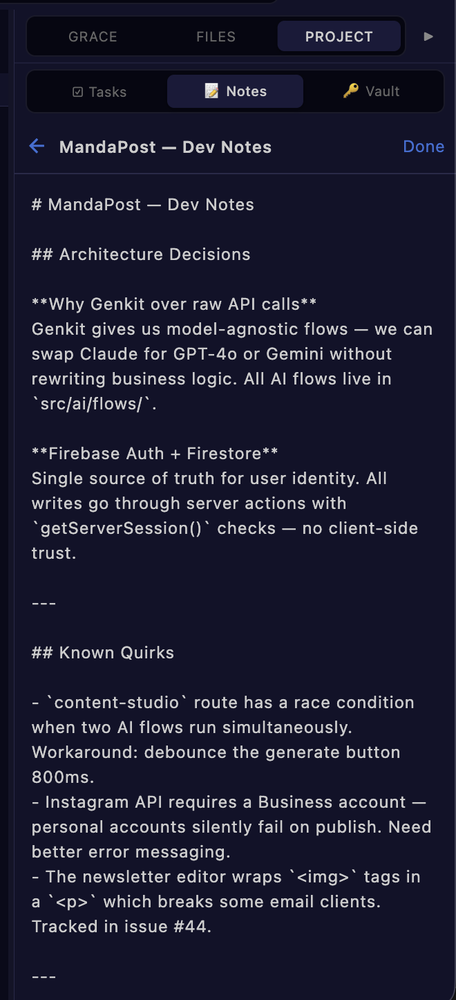
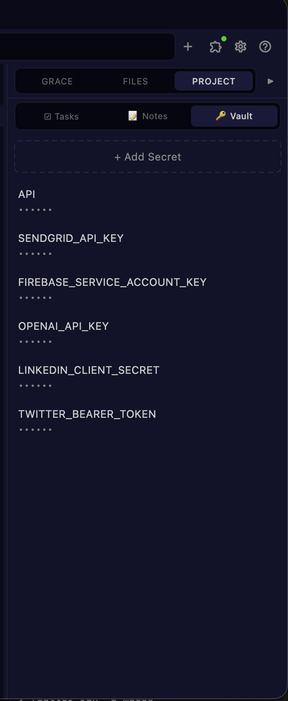
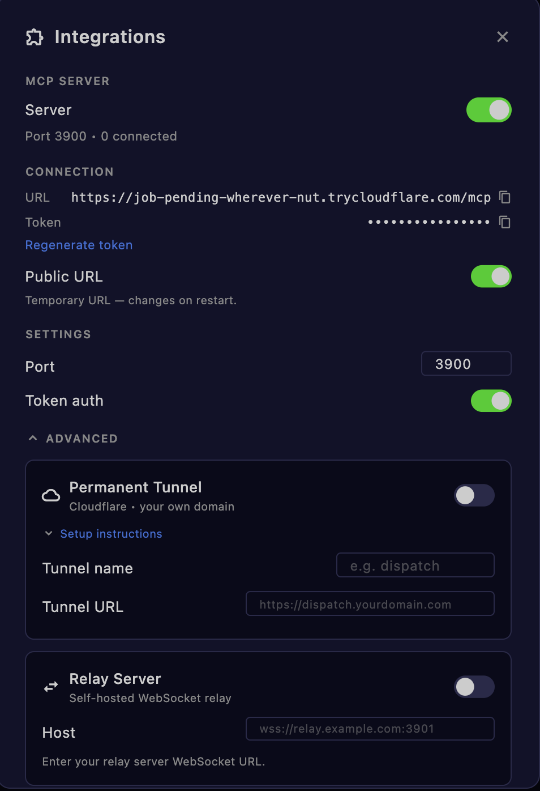

# Dispatch

A native macOS terminal orchestrator for AI-powered development. Run Claude Code, Codex, Gemini, and shell sessions side by side — with Grace, a built-in AI assistant that coordinates your agents, manages project context, and keeps everything in sync.

Built with Flutter, Riverpod, and Drift.

---

## Features

### Multi-Terminal Split View

Run multiple terminals simultaneously with horizontal and vertical splits. Each terminal is a full PTY session with native xterm rendering.



### Multi-Provider Agent Support

Work with Claude Code, OpenAI Codex, Gemini, and standard shell sessions in the same workspace. Grace orchestrates across all of them.



### Grace — Built-in AI Assistant

Grace lives in the right panel and has full context of your project. She can delegate tasks to subagents, manage files, run commands, track progress, and answer questions about your codebase.

### Approval Notifications

When a terminal needs your approval (permission prompts, confirmation dialogs), the tab lights up and Grace can alert you — no more missed prompts buried in background terminals.



### Quick Launch Presets

Configure reusable launch presets for common workflows — Claude Code, resume sessions, skip permissions, or custom shell commands. One click to spawn.



### File Tree

Browse your project's file structure directly in the right panel without leaving Dispatch.



### Project Tasks

Built-in task tracker scoped to each project. Add, check off, and manage tasks without switching to another app.



### Project Notes

Markdown-rendered notes per project. Architecture decisions, known quirks, dev logs — all accessible from the right panel.



### Secret Vault

Store API keys and secrets per project. Accessible to Grace and MCP tools without hardcoding credentials in your codebase.



### MCP Integration

Built-in MCP server with Cloudflare tunnel support, relay server option, and token auth. Connect external agents and tools to Dispatch over HTTP.



---

## Requirements

- macOS 13+
- Flutter 3.41+

## Getting Started

```bash
cd packages/dispatch_app
flutter run -d macos
```

## License

All rights reserved.
